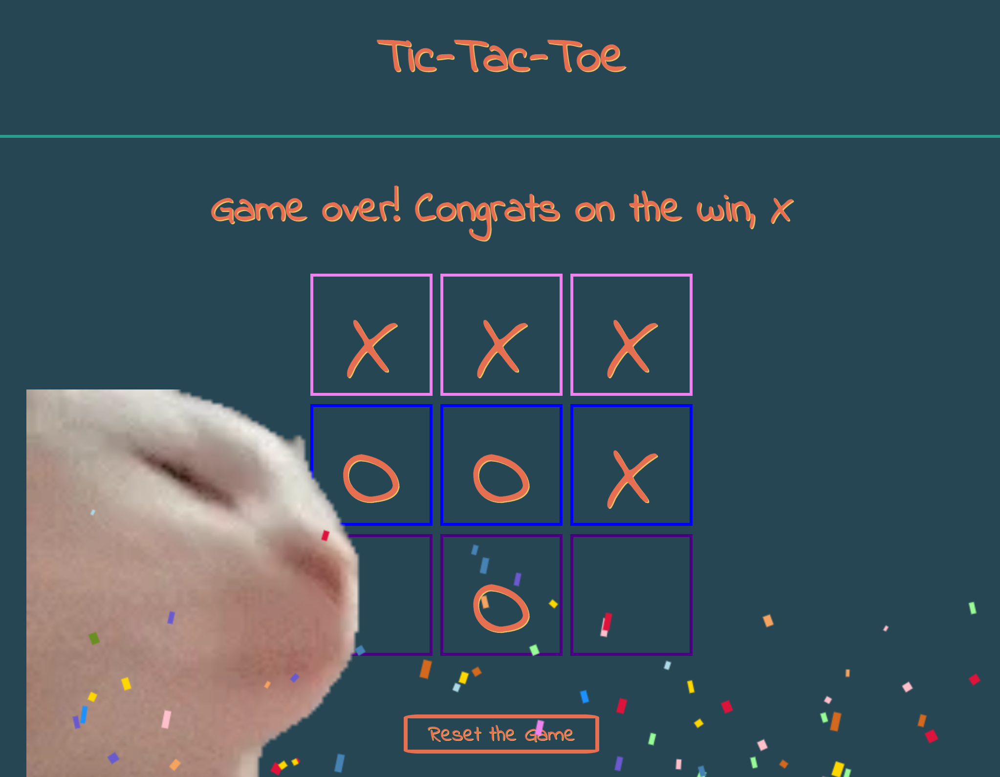

<h1>Tic-Tac-CatJam</h1>

<h3>ABOUT THE GAME</h3>

<i>
A fun twist on the traditional tic-tac-toe, Tic-Tac-CatJam was my first project from my General Assembly Software Engineering Immersive Bootcamp. To celebrate a win, the board flashes in a rainbow rave, "Carried Away" by Passion Pit plays and confetti falls as the classic CatJam Gif bobs to the beat.</i>
<h3>:warning: Warning: Please do not play if sensitive/reactive to flashing lights! :rotating_light:
 
<h3>LINK TO PLAY GAME HERE:</h3>
<a href="https://amandatictactoe.netlify.app">Tic-Tac-CatJam</a>
 
 

 
 
<h3>Technologies Used</h3>
<ul>
  <li>Javascript</li>
  <li>CSS</li>
  <li>HTML</li>
  <li>Google Fonts</li>
  <li>VSCode</li>
  <li>Firefox Developer Tools</li>
  <li>Google Chrome Developer Tools</li>
</ul>
<h3>Sources:</h3>
<ul>
  <li>Google Fonts - Indie Flower font-family</li>
  <li>Giphy - CatJam Gif</li>
  <li>Confetti - confetti.js from General Assembly Immersive</li>
  <li>Passion Pit - "Carried Away" .mp3 file</li>